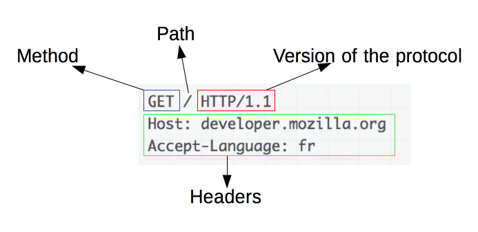

# HTTP Request/Response Message 구조
## HTTP Request Message 구조

- HTTP 메서드 : 클라이언트가 서버에게 보내는 요청 방식 종류
  - GET, POST 등
- 요청 URI : 클라이언트가 서버에게 요청하는 자원이 있는 경로
- HTTP 버전 : HTTP 프로토콜 버전 (HTTP/1.1, HTTP/2 등)
- 헤더(header) : HTTP 요청에 대한 부가적인 정보를 포함한 헤더
- 본문(body) : 요청 메시지에 대한 본문 데이터

## HTTP Request Message Header 구조

- 요청 라인(Request Line)
  - 요청 메서드, 요청 URI, HTTP 버전으로 구성된 정보
  - 예를 들어 "GET /index.html HTTP/1.1"와 같은 요청 라인이 있습니다.
- 일반 헤더(General Header)
  - 요청과 응답 모두에서 사용할 수 있는 정보
  - 예를 들어 메시지의 전송 시간과 크기
- 요청 헤더(Request Header)
  - 클라이언트가 서버에게 전달하는 요청 정보
  - 예를 들어 메시지의 인증 정보, 캐시 제어 및 선호하는 언어와 같은 정보를 전달함
- 엔티티 헤더(Entity Header)
  - **요청 메시지가 전송하는 데이터에 대한 정보**를 포함
  - 예를 들어 데이터의 인코딩, 크기, 유형 등

- HTTP Method: 요청 방법(GET, POST, PUT, DELETE 등)
- Request URI: 요청 URI (Uniform Resource Identifier) 정보
- Host: 요청하는 서버의 호스트 이름과 포트 정보
- User-Agent: HTTP 클라이언트의 소프트웨어 정보
- Accept: 클라이언트가 처리 가능한 MIME 타입 정보
- Connection: 클라이언트와 서버 간의 연결 유지 방법
- Content-Length: Request Body의 길이
- Content-Type: Request Body의 타입
- Authorization: 인증 정보 (Basic, Digest 등)
- Cookie: 쿠키 정보 (클라이언트 측에서 저장된 정보)

## HTTP Response Message 구조

- **상태 코드(Status Code)**
  - 클라이언트에게 요청이 완료됬는지 알려줌
  - HTTP 서버 응답 상태 코드는 3자리 숫자로 구성됨
  - 예를 들어 200 OK는 요청이 성공적으로 완료되었음을 나타냄
- **상태 메시지(Status Message)**
  - 상태 코드와 함께 제공하는 간단한 상태 메시지
  - 200 OK 상태코드에서 "OK"가 상태 메시지
- **HTTP 버전**
  - 서버가 사용하는 HTTP 프로토콜 버전
  - HTTP/1.0, HTTP/1.1, HTTP/2.0
- **컨텐츠 타입(Content Type)**
  - 서버가 클라이언트에게 보내는 리소스의 타입
  - text/html, image/png와 같은 MIME 타입
- **컨텐츠 길이(COntent Length)**
  - 응답 본문 데이터의 길이
- **캐시 제어(Cache Control)**
  - 브라우저에서 리소스를 캐시할 때 사용하는 지시어
  - 이 값을 사용하여 캐시 기간, 캐시 적용 범위 등을 설정함
- **리다이렉션(Redirection)**
  - 클라이언트가 요청한 리소스가 다른 위치에 있는 경우, 서버가 새로운 URI를 응답에 포함시켜 리다이렉션 할 수 있음
- **쿠키(Cookie)**
  - 쿠키는 서버에서 클라이언트로 쿠키 데이터를 전송하여 저장하게 하고, 다음 요청시 이 데이터를 사용할 수 있도록 함
- **기타(기타 헤더)**
  - 서버에서 클라이언트로 전송하는 기타 정보
  - 사용자 에이전트, 서버의 시간대 등
- **본문 데이터(Response Body)**