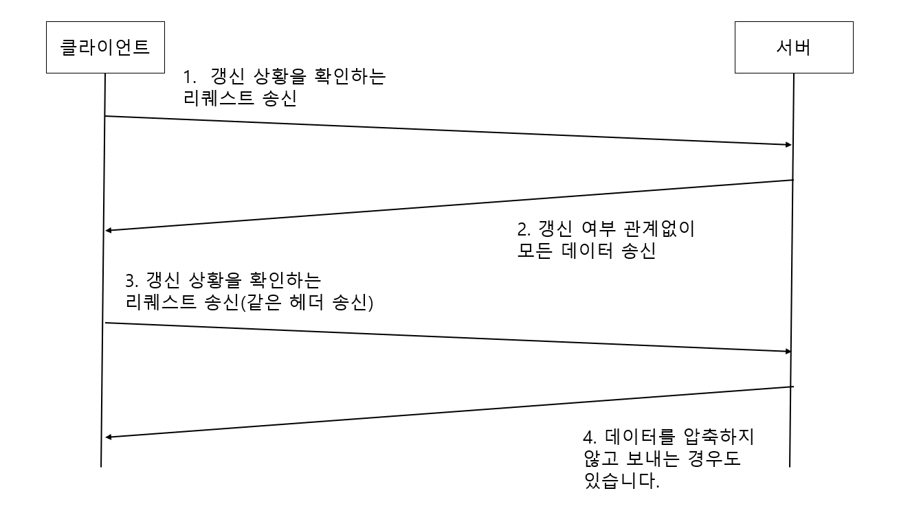
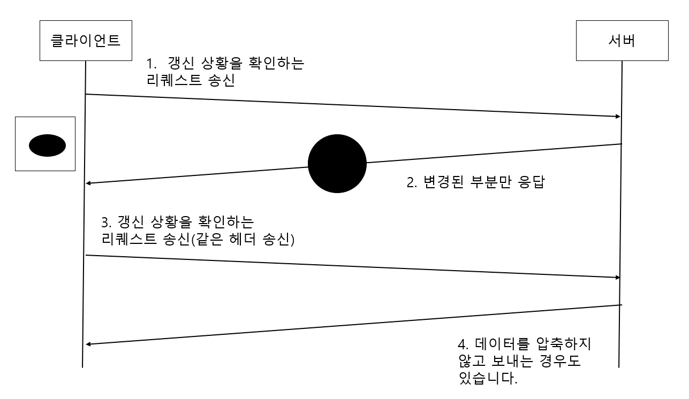
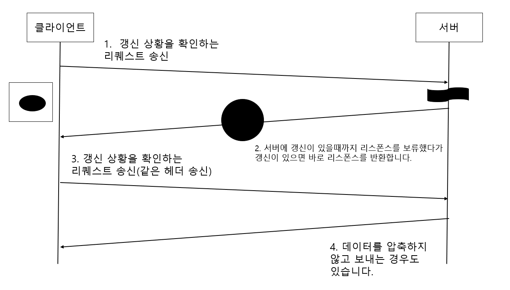

# HTTP에 기능을 추가한 프로토콜

## 목차

- HTTP를 기본으로하는 프로토콜

# HTTP를 기본으로하는 프로토콜

HTTP의 본래 용도는 HTML 파일을 전송하기 위한 프로토콜로 생각하였습니다.

그러나 시간이 지나면서 쇼핑 사이트, SNS와 같은 용도로 추가되었습니다.

하지만 HTTP라는 프로토콜로는 제한이나 한계가 존재하였습니다.

그래서 HTTP를 기반으로 추가하는 형태로 새로운 프로토콜이 구현되었습니다.

# HTTP의 병목 현상을 해소하는 SPDY

- Google 2010 발표
- HTTP 병목 현상 해결 및 로딩 시간 50% 단축 목표를 세우고 개발되고 있습니다.

## HTTP의 병목 현상

### 병목 현상의 사례

SNS는 사람들이 작성한 정보를 실시간으로 볼수 있습니다.
많은 유저가 메시지 등의 정보를 작성하면 웹 사이트에 그 정보들이 추가되면서 단시간에 대량의 갱신 정보가 발생합니다.

서버 정보가 갱신되었을 때 클라이언트의 화면에 반영할 필요가 있습니다.
그러나 HTTP에서는 이 처리를 제대로 처리를 할 수 없습니다.
이유는 갱신되었는지 알기 위해서는 클라이언트가 서버에 갱신 요청해야 하기 때문입니다.
만약 서버가 갱신되지 않았는데 클라이언트가 요청하게 되면 불필요한 통신이 발생하게 됩니다.

단순히 HTTP로 통신하게 된다면 다음과 같은 병목 현상이 발생합니다.

- 1개의 연결로 1개의 요청만 보낼 수 있습니다.
- 리퀘스트는 클라이언트에서만 시작할 수 있습니다. 리스폰스만 받는 것은 불가능합니다.
- 리퀘스트/리스폰스 헤더를 압축하지 않은채로 전달하여 헤더의 정보가 많을수록 지연이 심해집니다.
- 매번 같은 헤더를 보내 낭비가 발생합니다.
- 데이터 압축이 선택적입니다.

다음 그림은 기존 HTTP 통신을 나타낸 그림입니다.

### Ajax에 의한 해결 방법

- Ajax(Asynchronous Javascript XML) : JS나 DOM 조작 등을 활용하는 방식으로, 웹 페이지의 일부분만 고쳐쓸 수 있는 비동기 통신 방법입니다.
- 기존 동기식 통신에 비해서 페이지의 일부분만 갱신되기 때문에 리스폰스 데이터 양을 줄일 수 있습니다.
- Ajax 핵심 기술
    - XMLHttpRequest API : JS 언어로 서버와 HTTP 통신할 수 있습니다.
- 하지만 HTTP가 가지고 있는 문제는 해결되는 것은 아닙니다.

### Comet에 의한 해결 방법

- Comet : 서버 측의 콘텐츠에 갱신이 일어나는 경우, 클라이언트로부터 리퀘스트를 기다리지 않고 클라이언트에 보내기 위한 방법
- Comet에서는 리스폰스를 보류 상태로 해두고, 서버의 콘텐츠가 갱신되었을 때에 리스폰스를 반환합니다.
- 콘텐츠를 실시간으로 갱신시킬 수 있지만 리스폰스를 보류하기 위해서 연결을 유지하는 시간이 늘어납니다. 이 과정에서 연결하기 위한 리소스를 소비합니다.
- Comet 또한 HTTP 자체의 문제가 해결되는 것은 아닙니다.

### SPDY의 목표

- Ajax와 Comet 등의 방법으로 개선되었지만 HTTP 프로토콜의 제약을 없앨 수는 없습니다.
- SPDY는 HTTP의 제약인 병목 현상을 프로토콜 레벨에서 해소하기 위해 개발된 프로토콜입니다.
