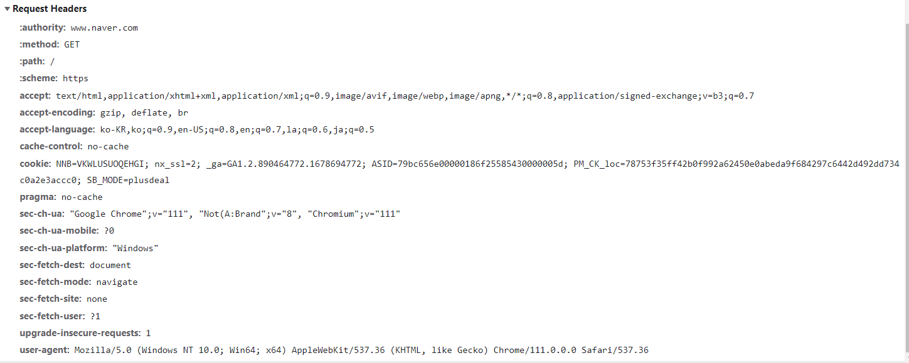
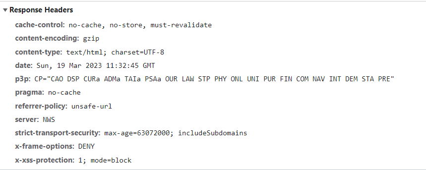

# HTTP 메시지 헤더

## HTTP 메시지 구조

- 메시지 헤더
- 개행 문자
- 메시지 바디

메시지 헤더에는 클라이언트나 서버가 리퀘스트나 리스폰스 메시지를 처리하기 위한 정보가 들어있습니다.

메시지 바디에는 클라이언트의 경우 서버에게 제출할 데이터가 들어있습니다. 서버의 경우에는 클라이언트의 요청에 따른

응답 데이터들이 저장되어 있습니다.

## HTTP 리퀘스트 메시지의 메시지 헤더

- 리퀘스트 라인(Request Line)
    - 메소드
    - URI
    - HTTP 버전
- HTTP 헤더 필드
    - 리퀘스트 헤더 필드
    - 일반 헤더 필드
    - 엔티티 헤더 필드

다음 그림은 "https://www.naver.com"에 접근했을때 리퀘스트 메시지에 있는 메시지 헤더의 예입니다.



## HTTP 리스폰스 메시지의 메시지 헤더

- 상태 라인
    - HTTP 메시지
    - HTTP 버전
    - 상태 코드
- HTTP 헤더 필드
    - 리스폰스 헤더 필드
    - 일반 헤더 필드
    - 엔티티 헤더 필드

다음 그림은 "https://www.naver.com"에 접근했을때 리스폰스 메시지에 있는 메시지 헤더의 예입니다.



# HTTP 헤더 필드

## HTTP 헤더 필드는 중요한 정보를 전달합니다.

HTTP 헤더 필드는 HTTP 메시지의 구성 요소입니다. HTTP 헤더 필드는 클라이언트나 서버가 리퀘스트 메시지나 리스폰스 메시지를

전송 시 필요한 정보들이 저장되는 공간입니다. 예를 들어 메시지 바디의 크기, 사용하고 있는 언어, 인증 정보 등을

브라우저나 서버에 제공하기 위해 저장됩니다.

## HTTP 헤더 필드의 구조

### HTTP 헤더 필드명 형식

```
헤더필드명:필드값
```

예를 들어 메시지 바디의 컨텐츠 타입을 가리키는 Content-Type 헤더 필드는 다음과 같이 표현될 수 있습니다.

```
Content-Type:text/html
```

또한 다음과 같이 하나의 헤더 필드에 여려 필드값을 가질 수 있습니다.

```
Keep-Alive:timeout=15,max=100
```

## 4종류의 HTTP 헤더 필드

### 일반적 헤더 필드

HTTP 리퀘스트 메시지와 HTTP 리스폰스 메시지 둘다 사용하는 필드입니다.

### 리퀘스트 헤더 필드

HTTP 리퀘스트 메시지가 사용하는 필드입니다.

리퀘스트의 부가적인 정보와 클라이언트 정보, 리스폰스의 컨텐츠에 관한 우선 순위 등을 부가합니다.

### 리스폰스 헤더 필드

HTTP 리스폰스 메시지가 사용하는 필드입니다.

리스폰스의 정보와 서버의 정보, 클라이언트의 추가 정보 요구 등을 부가합니다.

### 엔티티 헤더 필드

HTTP 리퀘스트 메시지와 HTTP 리스폰스 메시지 둘다 사용하는 헤더 필드입니다.

컨텐츠 갱신 시간 등의 엔티티에 관한 정보를 부가합니다.

## HTTP/1.1 헤더 필드 일람

### 일반 헤더 필드

| 헤더 필드 명           | 설명                    |
|-------------------|-----------------------|
| Cache-Control     | 캐싱 동작 지정              |
| Connection        | Hop-by-hop 헤더, 커넥션 관리 |
| Date              | 메시지 생성 날짜             |
| Pragma            | 메시지 제어                |
| Trailer           | 메시지의 끝에 있는 헤더의 일람     |
| Transfer-Encoding | 메시지 바디의 전송 코딩 형식 지정   |
| Upgrade           | 다른 프로토콜에 업그레이드        |
| Via               | 프록시 서버에 관한 정보         |
| Warning           | 에러 통지                 |

### 리퀘스트 헤더 필드

| 헤더 필드 명             | 설명                                       |
|---------------------|------------------------------------------|
| Accept              | 유저 에이전트가 처리 가능한 미디어 타입                   |
| Accept-Charset      | 문자셋 우선 순위                                |
| Accept-Language     | 언어(자연어) 우선 순위                            |
| Authorization       | 웹 인증을 위한 정보                              |
| Expect              | 서버에 대한 특정 동작의 기대                         |
| From                | 유저의 메일 주소                                |
| Host                | 요구된 리소스의 호스트                             |
| If-Match            | 엔티티 태그의 비교                               |
| If-Modified-Since   | 리소스의 갱신 시간 비교                            |
| If-None-Match       | 엔티티 태그의 비교(If-Match의 반대)                 |
| If-Range            | 리소스가 갱신되지 않은 경우에 엔티티의<br/>바이트 범위의 요구를 송신 |
| If-Unmodified-Since | 리소스의 갱신 시간 비교(If-Modified-Since의 반대)     |
| Max-Forwards        | 최대 전송 홉 수                                |
| Proxy-Authorization | 프록시 서버의 클라이언트 인증을 위한 정보                  |
| Range               | 엔티티 바이트 범위 요구                            |
| Referer             | 리퀘스트중의 URI를 취득하는 곳                       |
| TE                  | 전송 인코딩의 우선 순위                            |
| User-Agent          | HTTP 클라이언트의 정보                           |

### 리스폰스 헤더 필드

| 헤더 필드 명            | 설명                           |
|--------------------|------------------------------|
| Accept-Ranges      | 바이트 단위의 요구를 수신할 수 있는지 없는지 여부 |
| Age                | 리소스의 지정 경과 시간                |
| Etag               | 리소스 특정하기 위한 정보               |
| Location           | 클라이언트를 지정한 URI에 리다이렉트        |
| Proxy-Authenticate | 프록시 서버의 클라이언트 인증을 위한 정보      |
| Retry-Alter        | 리퀘스트 재시행의 타이밍 요구             |
| Server             | HTTP 서버 정보                   |
| Vary               | 프록시 서버에 대한 캐시 관리 정보          |
| WWW-Authenticate   | 서버의 클라이언트 인증을 위한 정보          |

### 엔티티 헤더 필드

| 헤더 필드 명          | 설명                   |
|------------------|----------------------|
| Allow            | 리소스가 제공하는 HTTP 메소드   |
| Content-Encoding | 엔티티 바디에 적용되는 콘텐츠 인코딩 |
| Content-Language | 엔티티의 자연어             |
| Content-Length   | 엔티티 바디의 사이즈(단위: 바이트) |
| Content-Location | 리소스에 대앙하는 대체 URI     |
| Content-MD5      | 엔티티 바디의 메시지 다이제스트    |
| Content-Range    | 엔티티 바디의 범위 위치        |
| Content-Type     | 엔티티 바디의 미디어 타입       |
| Expires          | 엔티티 바디의 유효기간 날짜      |
| Last-Modified    | 리소스의 최종 갱신 날짜        |

## HTTP/1.1 이외의 헤더 필드

HTTP에서 교환되는 HTTP 헤더 필드가 RFC2616에서 정의된 47종류만 있는 것은 아닙니다.

예를 들어 쿠키와 Set-Cookie, Content-Disposition와 같이 그 외에 RFC에 정의되어 폭 넓게 사용되고 있습니다.

비표준 헤더 필드는 **RFC4229 HTTP Header Field Registrations**에 정리되어 있습니다.

## End-to-end 헤더와 Hop-by-hop 헤더

HTTP 헤더 필드는 캐시와 비캐시 프록시의 동작을 정의하기 위해서 두 가지 카테고리로 분류되어 있습니다.

- End-to-end 헤더
    - 이 헤더는 리퀘스트나 리스폰스의 최종 수신자에게 전송됩니다.
    - 캐시에서 구축된 리스폰스 중 보존되어야 합니다.
    - 다시 전송되지 않으면 안 되도록 되어 있습니다.
- Hop-by-hop 헤더
    - 이 헤더는 한번 전송에 대해서만 유효하고 캐시와 프록시에 의해서 전송되지 않은 것도 있습니다.
    - HTTP/1.1과 그 이후에서 사용되는 Hop-by-hop 헤더는 Connection 헤더 필드에 열거해야 합니다.

Hop-by-hop 헤더 구성요소

- Connection
- Keep-Alive
- Proxy-Authenticate
- Proxy-Authorization
- Trailer
- TE
- Transfer-Encoding
- Upgrade

위 Hop-by-hop 헤더 구성요소를 제외한 다른 필드는 전부 End-by-end 헤더에 분류됩니다.

# HTTP/1.1 일반 헤더 필드
일반 헤더 필드는 리퀘스트, 리스폰스 양쪽에서 모두 사용하는 헤더 필드입니다.

## Cache-Control
Cache-Control 헤더는 디렉티브로 불리는 명령을 사용하여 캐싱 동작을 지정합니다.


