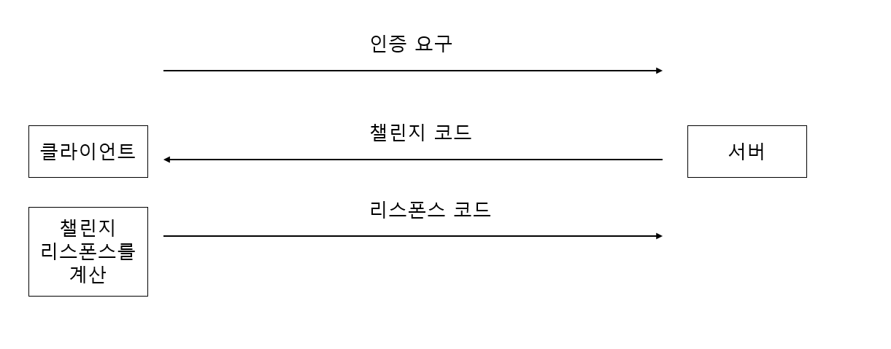

# 누가 액세스하고 있는지를 확인하는 인증

## 목차

- 인증이란?
- BASIC 인증

# 인증이란?

클라이언트인 "우에노" 본인인지 아닌지 확인하기 위해서는 "등록된 본인만이 알고 있는 정보"나 "등록한 본인만이 가지고 있는 정보" 등으로 확인할 필요가 있습니다.

등록된 정보 또는 등록한 정보의 종류

- 패스워드 : 본인만 알고 있는 문자열 정보
- 원타임 토큰 : 본인만이 가지고 있는 기기 등에 표시되는 한번 쓰고 버리는 패스워드 등의 정보
- 전자 증명서 : 본인(단말기)만이 가지고 있는 정보
- 바이오 매트릭스 : 지문이나 홍채 등 본인의 신체 정보
- IC 카드 : 본인만이 가지고 있는 정보

### HTTP에서 사용하는 인증 방법

- BASIC 인증
- DIGEST 인증
- SSL 클라이언트 인증
- 폼 베이스 인증

# BASIC 인증

- HTTP/1.0에 구현된 인증 방식
- 웹 서버와 클라이언트 사이에서 이루어지는 인증 방식

## BASIC 인증 수순

### BASIC 인증 단점

BASIC 인증에서는 Base64라는 인코딩 형식을 사용하고 있지만 이것은 암호화가 아니기 때문에 아무런 부가 정보 없이 복호화 할수 있습니다.

# DIGEST 인증

- BASIC 인증 약점을 보완한 인증
- HTTP/1.1에 소개되었습니다.
- **DIGEST 인증은 챌린지 리스폰스 방식이 사용되고 있습니다.**

챌린지 리스폰스 방식

- 최초에 상대방에게 인증 요구를 보내고 상대방 측에서 받은 챌린지 코드를 사용해서 리스폰스 코드를 계산합니다.
  이 값을 상대에게 송신하여 인증을 하는 방법입니다.

## DIGEST 인증 수순

