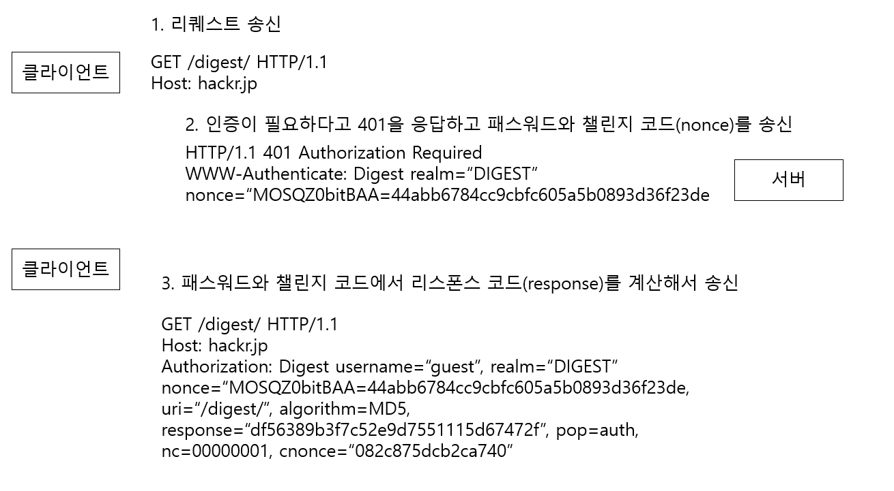

# 누가 액세스하고 있는지를 확인하는 인증

## 목차

- [인증이란?](#인증이란?)
- [BASIC 인증](#BASIC-인증)
- [DIGEST 인증](#DIGEST 인증)
- [SSL 클라이언트 인증](#SSL-클라이언트-인증)
- [폼 베이스 인증](#폼-베이스-인증)

# 인증이란?

클라이언트인 "우에노" 본인인지 아닌지 확인하기 위해서는 "등록된 본인만이 알고 있는 정보"나 "등록한 본인만이 가지고 있는 정보" 등으로 확인할 필요가 있습니다.

등록된 정보 또는 등록한 정보의 종류

- 패스워드 : 본인만 알고 있는 문자열 정보
- 원타임 토큰 : 본인만이 가지고 있는 기기 등에 표시되는 한번 쓰고 버리는 패스워드 등의 정보
- 전자 증명서 : 본인(단말기)만이 가지고 있는 정보
- 바이오 매트릭스 : 지문이나 홍채 등 본인의 신체 정보
- IC 카드 : 본인만이 가지고 있는 정보

### HTTP에서 사용하는 인증 방법

- BASIC 인증
- DIGEST 인증
- SSL 클라이언트 인증
- 폼 베이스 인증

# BASIC 인증

- HTTP/1.0에 구현된 인증 방식
- 웹 서버와 클라이언트 사이에서 이루어지는 인증 방식

## BASIC 인증 수순

### BASIC 인증 단점

BASIC 인증에서는 Base64라는 인코딩 형식을 사용하고 있지만 이것은 암호화가 아니기 때문에 아무런 부가 정보 없이 복호화 할수 있습니다.

# DIGEST 인증

- BASIC 인증 약점을 보완한 인증
- HTTP/1.1에 소개되었습니다.
- **DIGEST 인증은 챌린지 리스폰스 방식이 사용되고 있습니다.**

챌린지 리스폰스 방식

- 최초에 상대방에게 인증 요구를 보내고 상대방 측에서 받은 챌린지 코드를 사용해서 리스폰스 코드를 계산합니다.
  이 값을 상대에게 송신하여 인증을 하는 방법입니다.

## DIGEST 인증 수순

1. 클라이언트가 인증이 필요한 리소스를 요청합니다.
2. 서버는 401을 응답하며 챌린지 리스폰스 방식의 인증에 필요한 챌린지 코드(nonce)를 WWW-Authenticate 헤더 필드에 포함해서 리스폰스를 반환합니다.
3. 401 응답을 받은 클라이언트는 DIGEST 인증을 위해서 필요한 정보를 Authorization 헤더 필드에 포함해서 리스폰스 코드를 송신합니다.
  - Authorization 헤더 필드 필수 정보
    - username, realm, nonce, uri, response
    - realm, nonce는 서버에서 받은 것을 사용합니다.
    - username : realm에서 인증 가능한 사용 자이름
    - uri(digest-uri) : Request-URI와 동일할 수 있고, 프록시에 의해서 변경되는 경우도 있기 때문에 여기에 저장합니다.
    - response : Request-Digest라고 불립니다. 패스워드 문자열을 MD5로 계산한 것입니다.
4. Authorization 헤더 필드를 포함한 리퀘스트를 받은 서버는 인증 정보가 정확한지 검사합니다.
  - 인증 정보 정확한 경우 : Request-URI의 리소스를 포함한 리스폰스를 반환합니다.
  - 인증 정보 틀린 경우 : 401 상태 코드로 응답합니다.

### DIGEST 인증 방식과 BASIC 인증 방식
- DIGEST 인증은 BASIC 인증보다 높은 보안 등급을 제공하고 있습니다. 하지만 HTTPS의 클라이언트 인증과 비교하면 낮습니다.
- DIGEST 인증은 패스워드 도청을 방지하기 위한 기능이 있지만 위장을 방지하는 기능은 없습니다.
- DIGEST 인증도 BASIC 인증과 마찬가지로 웹 사이트에서 요구하는 보안 등급에는 만족하지 않아 사용되고 있지는 않습니다.

# SSL 클라이언트 인증
- SSL 클라이언트 인증은 **HTTPS의 클라이언트 증명서**를 이용한 인증 방식입니다.

## SSL 클라이언트 인증의 인증 수순
1. 서버는 인증이 필요한 리소스를 요구하는 클라이언트에게 "Certificate Request" 메시지를 송신합니다.
2. 사용자는 송신할 클라이언트 증명서를 선택합니다. 증명서를 선택하게 되면 클라이언트는 "Client Certificate"라는 메시지를 전달합니다.
3. 서버는 클라이언트 증명서를 검증하여 검증 결과가 맞으면 **클라이언트의 공개키를 취득**합니다. 그 이후에 HTTPS에 의한 암호를 게시합니다.

## SSL 클라이언트 인증은 2-factor 인증에서 사용된다
SSL 클라이언트 인증은 단독으로 사용되지 않고, 폼 베이스 인증과 합쳐서 2-factor 인증에서 사용됩니다.

### 2-factor 인증이란?
2-factor 인증은 예를들면 패스워드와 같은 **한 개의 요소만이 아닌 이용자가 가진 다른 정보를 병행해서 인증을 하는 방법**입니다.

## SSL 클라이언트 인증 이용하는데 비용이 필요하다
SSL 클라이언트 인증에서는 클라이언트 증명서를 이용할 필요가 있습니다. 이러한 클라이언트 증명서를 이용하기 위해서는 비용이 필요합니다.

인증 기관에서 클라이언트 증명서를 구입하는 이용이나 서버의 운영자 자신이 인증 기고나을 만들어 안전하게 운용하기 위해 들어가는 비용이 됩니다.

# 폼 베이스 인증
폼 베이스 인증은 HTTP 프로토콜로서 사양이 정의되어 있는 인증 방식이 아닙니다.

클라이언트가 서버 상의 웹 애플리케이션에 자격 정보(Credential)를 송신하여 그 자격 정보의 검증 결과에 따라 인증하는 방식입니다.

대부분의 경우 사전에 등록해 둔 자격 정보인 유저 ID(임의의 문자열이나 메일 주소 등이 자주 사용된다)와 패스워드를 입력해서 이것을 웹 애플리케이션에 송신하고 검증 결과를 토대로 검증 성공 여부를 결정합니다.

## 인증의 대부분은 폼 베이스 인증
- HTTP가 표준으로 제공하는 BASIC 인증이나 DIGEST 인증은 보안문제로 사용되고 있지 않습니다.
- SSL 클라이언트 인증은 보안을 만족하지만 비용이 높은 문제가 있습니다.
- 웹 사이트의 인증 기능으로서 요구되는 기능의 레벨을 충족시킨 표준적인 것이 존재하지 않기 때문에 웹 애플리케이션에서 제각각 구현하는 폼 베이스 인증을 채용할 수 밖에 없습니다.
- 공통 사양이 결정되어 있지 않은 폼 베이스 인증에서는 웹 사이트 별로 다르게 구현을 하고 있습니다.

## 세션 관리와 쿠키에 의한 구현
폼 베이스 인증으로 자주 사용되는 방법은 **쿠키**를 사용하는 방법이 있습니다.

HTTP는 무상태(stateless) 프로토콜이여서 인증에 성공해도 유저의 상태를 유지할 수 없습니다. 그래서 세션관리와 쿠키를 사용하여 HTTP 에 없는 상태 관리 기능을 보충합니다.

### 쿠키를 이용한 상태 관리 과정

1. 클라이언트와 서버에 유저 ID나 패스워드 등의 자격 정보를 포함한 리퀘스트를 전달합니다.
  - POST 메소드가 사용되어 엔티티 바디에 자격 정보를 저장합니다.
  - HTML 폼 화면 표시와 입력 데이터 송신에 HTTPS 통신을 이용합니다.
2. 서버는 유저를 식별하기 위해서 세션 ID를 발행합니다.
  - Set-Cookie: 헤더 필드에 세션 ID를 저장해서 리스폰스를 반환합니다.
  - 세션 ID를 도난 당할 수 있습니다. 따라서 피해를 줄이기 위해서 쿠키에 httponly 속성을 부여합니다.
3. 세션 ID를 받은 클라이언트는 쿠키로 저장합니다.
  - 다음 요청시 쿠키를 같이 전송하여 인증 과정을 생략할 수 있도록 합니다.
