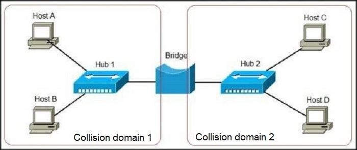

# 네트워크 구성
## 목차
- [x] [네트워크의 구성](#네트워크의-구성)
- [x] [네트워크의 형태](#네트워크의-형태)
- [x] [네트워크의 접속 장치](#네트워크의-접속-장치)
- [ ] [네트워크의 접속 형태](#네트워크의-접속-형태)
- [ ] [네트워크의 전송 매체](#네트워크의-전송-매체)

## 네트워크의 구성
- PC
- 네트워크 접속 장치
  - 스위치 : 한 네트워크 내부에서 데이터 저송을 수행하는 장치
  - 라우터 : 서로 다른 네트워크를 구분하고 연결하는 장치
- 네트워크 전송 매체
  - 유선
  - 무선

## 네트워크의 형태
- LAN(Local Area Network) : 건물안이나 특정 지역 범위안에서 네트워크로 통신
  - 가정집, 연구실
- WAN(Wide Area Network) : 2개 이상의 LAN을 넓은 지역에 걸쳐 연결한 통신
  - SKT, KT
- 인트라넷 : 인터넷에서 사용하는 회선과 여러 기반 기술을 이용하여 구축하는 사설 네트워크
  - 캠퍼스, 회사 사내 인트라넷

## 네트워크 접속 장치
- LAN 카드(Network Interface Card, NIC) : 네트워크에 접속하기 위해 필요한 카드
- 허브(Hub) : 여러개의 컴퓨터를 같은 네트워크로 연결하는 장치
  - 더미 허브 : 데이터를 연결된 다른 컴퓨터로 전송하는 장치
  - 스윙치 허브 : 스위칭기능이 있어 더미 허브보다 빠른 장치
    - 모두에게 데이터를 보내지 않고 한 컴퓨터에만 보낼 수 있음
  - 스태커블 허브 : 허브와 허브를 연결할 수 있는 허브
  - 인텔리전트 허브 : 데이터 제어와 분석이 가능한 허브
- 스위치(Switch) : 근거리 네트워크가 제공하는 대역폭을 컴퓨터로 모두 전송할 수 있는 장치
  - 연결된 컴퓨터 개수 상관없이 동일한 대역폭 제공
  - 허브보다 상위호한인 장치

- 브리지(Bridge) : 2개 이상의 근거리 통신망을 연결하여 하나의 네트워크로 만드는 장치

- 게이트웨이(Gateway) : 종류가 다른 2개 이상의 네트워크를 연결시켜주는 장치
- 중계기 : 접속 시스템 수를 증가시키거나 네트워크 전송 거리를 연장시키는 장치
- 라우터 : 서로 다른 네트워크 간에 통신하는데 사용하는 장치
  - LAN, MAN, WAN을 연결
  - IP주소를 수신지까지 효율적인 경로를 선택하여 보내줌 (라우팅)
