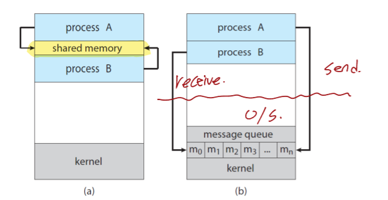
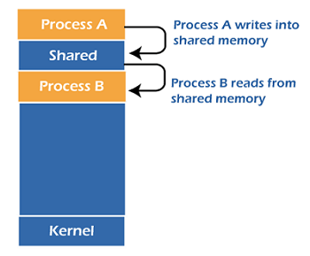

# 프로세스 통신
## 목차
- [x] 프로세스 통신
  - [x] IPC
  - [x] IPC 모델
- [ ] 프로세스 통신 방법
  - [x] 공유 메모리
  - [ ] 메시지 전송

# 프로세스 통신
## IPC
IPC(Interprocess Communication)는 프로세스들간의 데이터를 보내거나 데이터를 받아 데이터를 공유하는 것

## IPC 모델
1. 공유 메모리
2. 메시지 송수신



# 프로세스 통신 방법
## 공유 메모리
**공유 메모리(Shared Memory) 통신 방법은 각각의 프로세스가 공유 메모리 공간을 통해서 프로세스간의 데이터를 공유하는 기술**입니다.

각각의 프로세스는 공유 메모리 공간을 가리키는 주소를 가지고 있습니다.

프로세스 간 통신 방법 중 가장 빠릅니다.

운영 체제는 여러 프로세스의 주소 공간에 있는 메모리 세그먼트를 매핑하여 운영체제 기능을 호출하지 않고 해당 메모리에서 읽고 쓸 수 있습니다.

많은 양의 데이터를 교환하는 애플리케이션의 경우, 공유 메모리는 메시지 큐와 같은 메시지 전달 기술보다 좋습니다.

모든 데이터 교환에 시스템 호출이 필요합니다. 

공유 메모리를 사용하려면 두가지 단계가 필요합니다.
1. 프로세스 간에 공유할 수 있는 메모리 세그먼트를 운영체제게 요청
2. 해당 메모리 일부 또는 전체 메모리를 호출한 프로세스의 주소 공간과 연결

공유된 메모리 세그먼트는 여러개의 프로세들에 공유되는 물리적인 메모리 부분입니다.

이곳에서는 구조체를 만들수 있고 다른 프로세스는 구조체를 읽고 쓸수 있습니다.



두개 이상의 프로세스들간에 공유 메모리가 형성될때 각 프로세스들이 공유 메모리 공간을 가리키는 베이스 주소는 서로 다릅니다.


위 그림을 보면 프로세스 A의 메모리 매핑 시작주소는 0x60000인 반면 프로세스 B의 메모리 매핑 시작주소는 0x70000입니다.

따라서 프로세스 A의 주소 0x60000에 숫자 1을 저장하는 것은 프로세스 B의 0x70000에서 1의 값을 갖는다는 것을 의미합니다.

즉, 두개의 다른 주소가 같은 정확히 같은 공간을 가리키고 있다는 것을 의미합니다.

### IPC로 공유 메모리를 선택한 이유

일반적으로 상호 관계된 프로세스 통신은 Pipes나 Named Pipes를 사용하여 수행합니다. 

그리고 관계되지 않은 프로세스들간의 통신은 Named Pipes를 사용하여 수행되거나 공유 메모리와 메시지 큐의 IPC 기술을 통해 수행됩니다.

**그러나 Pipes, FIFO, 메시지 큐의 문제는 두 프로세스 사이에서 커널(운영체제)를 통해서 데이터가 교환된다는 것입니다.**
- 서버가 입력 파일을 읽음
- 서버는 Pipe, FIFO 또는 메시지 큐를 사용하여 이 데이터를 메시지 작성함
- 클라이언트는 IPC 채널을 통하여 데이터를 읽고 다시 커널의 IPC 버퍼에서 클라이언트의 버퍼로 데이터를 복사함
- 마지막으로 클라이언트의 버퍼로 데이터가 복사됨

총 4개의 복사본(읽기 2개, 쓰기 2개)이 필요합니다. 따라서 공유 메모리는 두개 이상의 프로세스가 메모리 세그먼트를 공유하도록 방법을

제공합니다. 공유 메모리를 사용하면 데이터가 입력 파일에서 공유 메모리로 공유 메모리에서 출력 파일로 단 두번만 복사됩니다.

### 공유 메모리를 사용한 IPC 함수 기능
- shmget : 공유 메모리 세그먼트 생성
- shmat : 공유 메모리 세그먼트를 프로세스의 주소 공간과 연결

#### shmget
shmget 문법
```
#include <sys/ipc.h>   
#include <sys/shm.h>   
int shmget (key_t key, size_t size, int shmflg);  
```
- key : 공유된 메모리 세그먼트를 식별하는 고유 번호
- size : 공유된 메모리 세그먼트의 크기
  - ex) 1024byte 또는 2048byte
- shmflg
  - 함수 동작 관련 플래그, IPC_CREAT, IPC_EXCL 로 구성된다. 
  - IPC_CREAT : 새로운 공유 메모리를 할당한다. 만약 이 플래그가 사용되지 않는다면, shmget() 함수는 key 와 연관된 공유 메모리를 찾고 사용자가 메모리에 접근할 수 있는 권한이 있는지 확인한다. 
  - IPC_EXCL : IPC_CREAT 와 함께 사용되며, 만약 공유 메모리가 이미 할당되어있다면 실패를 반환한다

shmget 함수 성공시 식별자 값을 반환하고 실패시 -1을 반환합니다.

#### shmat
```
#include <sys/types.h>  
#include <sys/shm.h>  
void *shmat(int shmid, const void *shmaddr, int shmflg);  
```
- shmid : 공유 메모리 세그먼트 식별자값
- *shmaddr : 호출하는 프로세스의 연결하고자 하는 주소 공간
  - NULL이라면 운영체제가 자동으로 맞춰줌
- shmflag
  - shmaddr = null이고 shmflag = 0이됨
  - 그외는 SHM_RND에 의해서 명시됨

### 공유 메모리 사용 IPC의 수행 방법
프로세스는 shmget 함수를 사용해서 공유 메모리 세그먼트 생성한다. 공유 메모리 세그먼트의 주인은 shmctl 함수를 사용해서

다른 사용자를 오너십으로 할당할 수 있습니다. 

프로그램 1

```c
#include<stdio.h>  
#include<stdlib.h>  
#include<unistd.h>  
#include<sys/shm.h>  
#include<string.h>  
int main()  
{  
  int i;  
  void *shared_memory;  
  char buff[100];  
  int shmid;  
  shmid=shmget((key_t)2345, 1024, 0666|IPC_CREAT);   
  //creates shared memory segment with key 2345, having size 1024 bytes. IPC_CREAT is used to create the shared segment if it does not exist. 0666 are the permissions on the shared segment  
  printf("Key of shared memory is %d\n",shmid);  
  shared_memory=shmat(shmid,NULL,0);   
  //process attached to shared memory segment  
  printf("Process attached at %p\n",shared_memory);   
  //this prints the address where the segment is attached with this process  
  printf("Enter some data to write to shared memory\n");  
  read(0,buff,100); //get some input from user  
  strcpy(shared_memory,buff); //data written to shared memory  
  printf("You wrote : %s\n",(char *)shared_memory);  
}  
```
```
Key of shared memory is 0
Process attached at 0x7ffe040fb000
Enter some data to write to shared memory 
Hello World
You wrote: Hello World 
```

프로그램 2
```
#include<stdio.h>  
#include<stdlib.h>  
#include<unistd.h>  
#include<sys/shm.h>  
#include<string.h>  
int main()  
{  
  int i;  
  void *shared_memory;  
  char buff[100];  
  int shmid;  
  shmid=shmget((key_t)2345, 1024, 0666);  
  printf("Key of shared memory is %d\n",shmid);  
  shared_memory=shmat(shmid,NULL,0); //process attached to shared memory segment  
  printf("Process attached at %p\n",shared_memory);  
  printf("Data read from shared memory is : %s\n",(char *)shared_memory);  
}  
```
```
Key of shared memory is 0
Process attached at 0x7f76b4292000
Data read from shared memory is: Hello World 
```

## 메시지 전송

## References
- [IPC through Shared Memory](https://www.javatpoint.com/ipc-through-shared-memory)

 