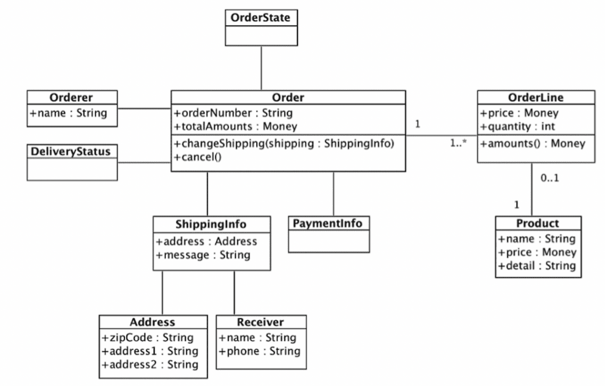
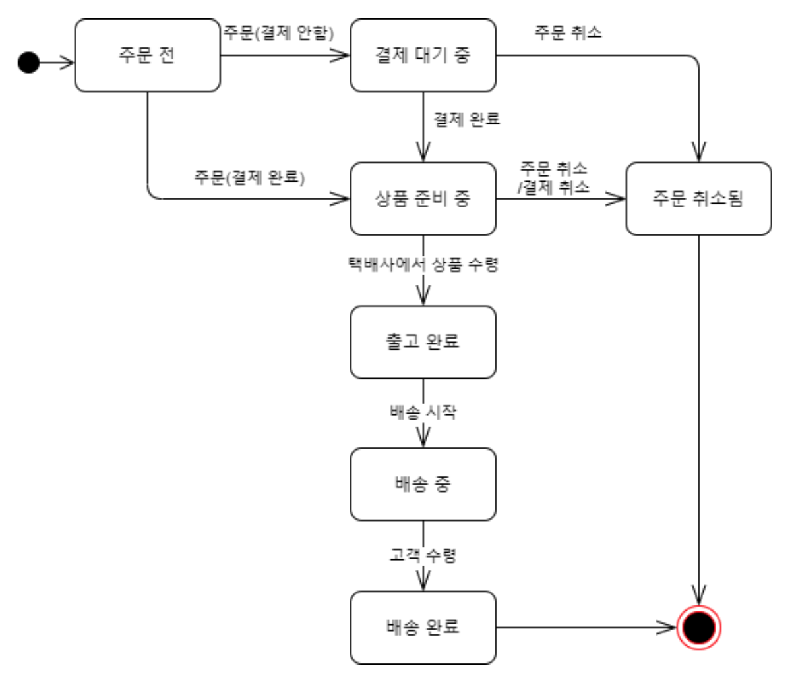

도메인
- 도메인은 현실 세계의 문제를 소프트웨어 개발로 해결하려고 하는 영역을 의미함
- "이 소프트웨어가 어떤 문제를 해결하기 위해 존재하는가?"에 대한 문맥
- 예를 들어 전자상거래 시스템 개발시 해당되는 도메인으로 "주문", "결제", "배송", "상품", "회원" 등의 도메인이 존재할 수 있음

요구사항을 올바르게 이해하는 방법
- 개발자와 전문가가 직접 대화하기
- 도메인 전문가만큼은 아니지만 개발자 또한 도메인 지식을 갖추기

도메인 모델
- 도메인을 개념적으로 표현한것

객체 기반 주문 도메인 모델
- 객체를 이용한 도메인 모델
- 도메인이 제공하는 기능과 주요한 데이터 구성을 파악할 수 있음


상태 다이어그램을 이용한 주문 상태 모델링
- 주문의 상태 변화를 설계되어 있음
- 다음 그림을 보고 상품 준비중 상태에서 주문최소하면 결제취소되고 취소 상태로 변화됨


도메인 모델 주의사항
- 도메인 모델을 표현할 때 클래스 다이어그램이나 상태 다이어그램과 같은 UML 표기법만 사용하지 않아도 된다.
- 예를 들어 도메인간에 관계가 중요한 도메인이라면 그래프를 이용해서 도메인을 모델링할 수 있다. 또는 계산 규칙이 중요한 도메인이라면 수학 공식을 활용해서 도메인 모델을 만들 수 있다.

하위 도메인과 모델
- 도메인은 여러개의 하위 도메인으로 구성됨
- 각 하위 도메인이 다루는 영역은 서로 다르기 때문에 같은 용어라도 하위 도메인마다 의미가 달라질 수 있다. 예를 들어 카탈로그 도메인의 상품이 상품 가격, 상세 내용을 담고 있다면, 배송 도메인의 상품은 고객에게 실제 배송되는 물리적인 상품을 의미함
- 여러 하위 도메인을 하나의 다이어그램에 모델링하면 안된다.

도메인 모델 패턴
- 일반적인 아키텍처 패턴은 4개의 영역으로 구성됨
	- 표현 영역
	- 응용 영역
	- 도메인 영역
	- 인프라스트럭처 영역


아키텍처 구성 설명
- 사용자 인터페이스 또는 표현 영역(Presentation)
	- 사용자의 요청을 받고 서비스에서 처리한 데이터를 사용자에게 응답하도록 전달하는 영역
	- 여기서 말하는 사용자는 사람만이 아닌 외부 시스템이 될 수 있다.
- 응용 영역(Application)
	- 사용자가 요청한 서비스 기능을 수행함
	- 도메인 계층을 조합해서 기능을 실행함
- 도메인 영역(Domain)
	- 시스템이 제공할 도메인 규칙을 구현함
- 인프라스트럭처(Infrastructure)
	- 데이터베이스나 메시징 시스템과 같은 외부 시스템과의 연동을 처리함

주문 도메인 규칙
- 출고 전에 배송지를 변경 할 수 있다.
- 주문 취소는 배송 전에만 할 수 있다.

주문 도메인 구현
- verifyNotYetShipped() 메서드를 실행해서 주문의 상태가 결제 대기 또는 준비중인 상태가 아니라면 예외를 발생시킴
```java
@Entity  
@Table(name = "purchase_order")  
@Access(jakarta.persistence.AccessType.FIELD)  
public class Order {  
	// ...
	
    @Column(name = "state")  
    @Enumerated(EnumType.STRING)  
    private OrderState state;  
    @Embedded  
    private ShippingInfo shippingInfo;  
    
    // ...
    
    private void setShippingInfo(ShippingInfo shippingInfo) {  
    if (shippingInfo == null) {  
       throw new IllegalArgumentException("no ShippingInfo");  
    }  
	    this.shippingInfo = shippingInfo;  
	}  
  
	public void changeShippingInfo(ShippingInfo newShippingInfo) {  
	    verifyNotYetShipped();  
	    setShippingInfo(newShippingInfo);  
	}  
	  
	private void verifyNotYetShipped() {  
	    if (state != OrderState.PAYMENT_WAITING && state != OrderState.PREPARING) {  
	       throw new IllegalStateException("already shipped");  
	    }  
	}
}
```
```java
public enum OrderState {  
    PAYMENT_WAITING,  
    PREPARING,  
    SHIPPED,  
    DELIVERING,  
    DELIVERY_COMPLETED,  
    CANCELED  
}
```

개념 모델과 구현 모델
- 개념 모델은 순수하게 문제를 분석한 결과물
	- 개념 모델은 데이터베이스, 트랜잭션 처리, 성능, 구현 기술과 같은 세부 구현방법에 대해서 고려하지 않는다.
- 초기에 완벽한 개념 모델을 만들 수 없다. 개발하면서 새로운 도메인 지식이나 통찰을 얻으면서 개념 모델과 도메인 모델은 변경된다.
- 개념모델은 처음부터 완벽한 개념 모델을 만든다는 생각보다는 간단히 개념 모델을 작성해야 한다. 그리고 구현하는 과정에서 개념 모델을 수정하면서 구현 모델로 점진적으로 발전시켜 나가야함

도메인 모델 추출하기
- 기획서, 유스케이스, 사용자 스토리와 같은 요구사항을 기반으로 도메인을 이해하고 이를 바탕으로 도메인 모델을 작성해야 합니다.

주문 도메인 관련 요구사항
- 최소 한 종류 이상의 상품을 주문해야 한다.  
- 한 상품을 한 개 이상 주문할 수 있다.  
- 총 주문 금액은 각 상품의 구매 가격 합을 모두 더한 금액이다.  
- 각 상품의 구매 가격 합은 상품 가격에 구매 개수를 곱한 값이다.  
- 주문할 때 배송지 정보를 반드시 지정해야 한다.  
- 배송지 정보는 받는 사람 이름, 전화번호, 주소로 구성된다.  
- 출고를 하면 배송지를 변경할 수 없다.  
- 출고 전에 주문을 취소할 수 있다.  
- 고객이 결제를 완료하기 전에는 상품을 준비하지 않는다.

주문 도메인 관련 요구사항을 기반으로한 기능 추출
- 출고 상태로 변경하기
- 배송지 정보 변경하기
- 주문 취소하기
- 결제 완료하기

다음 요구사항을 통해서 주문이 어떤 데이터로 구성되는지 알 수 있다.
- 주문항목(OrderLine)
- 주문 항목의 가격 합 = 상품 가격(price) x 구매 개수(quantity)
```
- 한 상품을 한개 이상 주문할 수 있다.
- 각 상품의 구매 가격 합은 상품 가격에 구매 개수를 곱한 값이다.
```

다음 요구사항을 통해서 주문(Order)과 주문항목(OrderLine)과의 관계를 보여줍니다.
- 주문과 주문항목은 일대다 관계로 구성된다. (orderLines)
- 주문의 총 주문 금액은 주문항목의 구매 가격의 합계 금액이 된다. (totalAmounts)
```
- 최소 한 종류 이상의 상품을 주문해야 한다.
- 총 주문 금액은 각 상품의 구매 가격 합을 모두 더한 금액이다.
```

다음 요구사항을 통해서 주문 객체 생성시 배송지 정보 객체 또한 같이 지정해야 한다는 것을 알 수 있다.
```
- 주문할 때 배송지 정보를 반드시 지정해야 한다.
```

다음 요구사항을 보면 주문 객체가 배송지를 변경하는 경우에 출고 이전의 상태라면 배송지를 변경할 수 있다. 
주문 취소 기능 구현시 주문 상태가 출고 이전 상태라면 주문을 취소할 수 있고 취소 이후의 상태라면 취소할 수 없다는 것을 알수 있다.
```
- 출고를 하면 배송지 정보를 변경할 수 없다.
- 출고 전에 주문을 취소할 수 있다.
```
다음 요구사항도 주문의 상태와 관련이 있다. 다음 요구사항을 통해서 주문 상태는 결제 완료 이전의 상태와 결제 완료 또는 상품 준비중이라는 상태가 필요하다는 것을 알수 있다.
```
- 고객이 결제를 완료하기 전에는 상품을 준비하지 않는다.
```

OrderState.java
```java
public enum OrderState {  
    PAYMENT_WAITING,  
    PREPARING,  
    SHIPPED,  
    DELIVERING,  
    DELIVERY_COMPLETED,  
    CANCELED  
}
```

문서화하는 이유
- 실제 구현은 코드를 보면 다 알 수 있지만, 코드는 상세한 모든 내용을 다루고 있기 때문에 코드를 이용해서 소프트웨어를 분석하려면 많은 시간이 소모됩니다.
- 코드를 보는것보다 상위 수준에서 정리한 문서를 참조하는 것이 소프트웨어 전반을 빠르게 이해하는데 도움될 수 있다. 우선은 전체적으로 이해하고 더 깊게 이해해야 하는 부분이 있다면 코드로 분석하면 된다.

