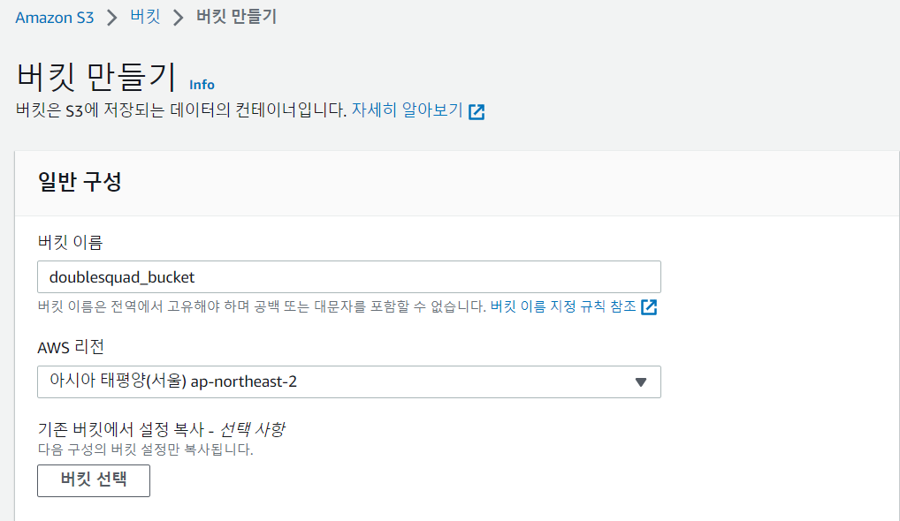
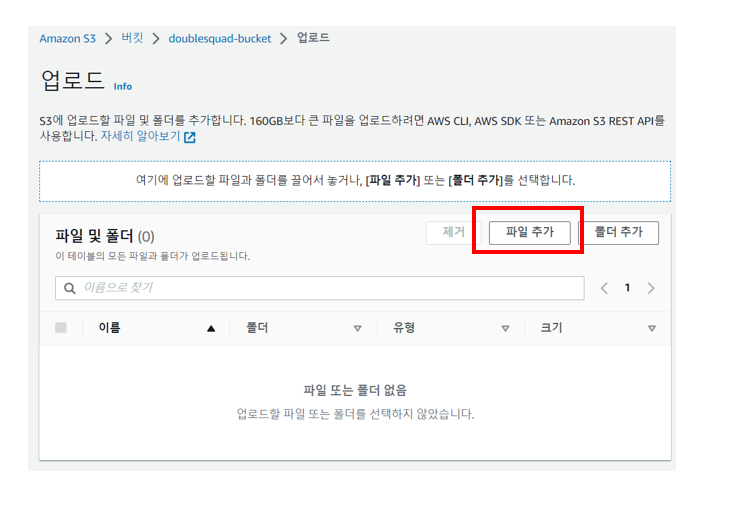
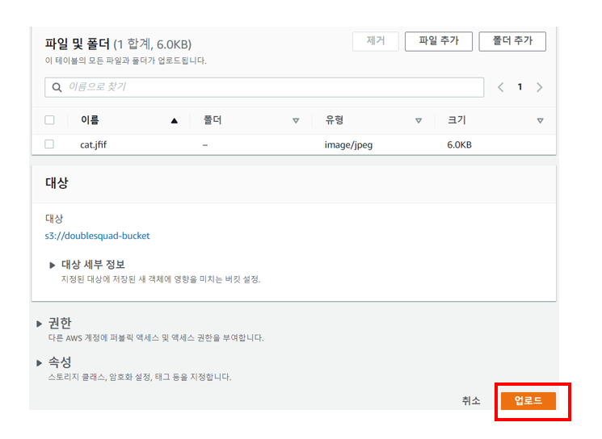
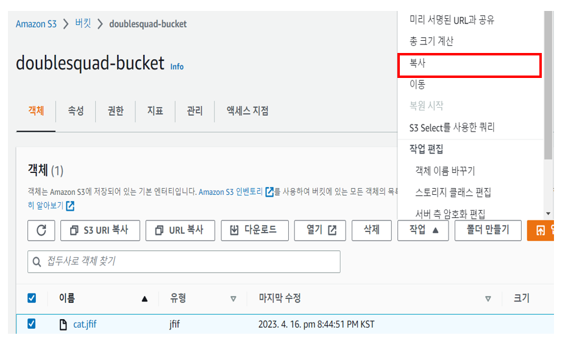
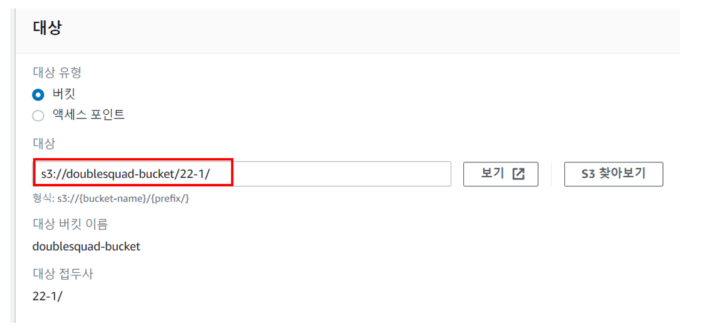
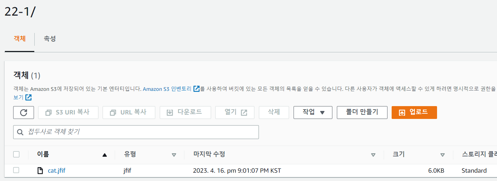

# S3

## S3(Simple Storage Service)란 무엇인가?

- AWS의 대표적 서비스
- 객체 스토리지
- 파일 업로드, 다운로드, 검색 가능
- 무제한 용량
- 다양한 인증 / 권한 부여 제공

## S3 특징

- 리전 기반 서비스
- 매우 안전 99.99%
- 상대적으로 빠르지는 않습니다.
- CDN과 연동이 가능합니다.
- 정적 웹 페이지 기능을 지원합니다.
- 필요에 따라 버저닝(Versioning) 기능 사용이 가능합니다.
- 다양한 요금 옵션으로 비용 절감 가능합니다.

## S3 사용예시

- 클라우드 저장소 (개인 파일 보관, 구글 드라이브처럼 사용이 가능합니다.)
- 서비스의 대용량 파일 저장소 : 이미지, 동영상, 빅데이터 (ex: 넷플릭스)
- 서비스 로그 저장 및 분석
- AWS 아데나를 이용한 빅데이터 업로드 및 분석
- 서비스 사용자의 데이터 업로드 서버 (이미지 서버, 동영상 서버)
- 중요한 파일은 EC2의 SSD(EBS)에 저장하지 말고 S3에 저장해야 합니다.
- glacier(빙하)와의 연동으로 잘 사용하지 않는 데이터에 대해서 비용을 절감할 수 있습니다.

## 버킷 생성

1. 스토리지 -> S3 -> 버킷 만들기

2. 버킷 이름 작성, 리전을 서울로 선택

3. 버킷 만들기

## 파일 업로드

1. 업로드할 버킷 선택

2. 업로드 버튼 클릭 -> 파일 추가 -> 업로드할 파일 선택

3. 업로드

## 파일 복사

1. 복사할 파일 선택
2. 작업 -> 복사 -> 대상에 s3://doublesquad-bucket/22-1

위 결과를 보면 22-1 폴더에 복사된 cat이 저장된 것을 확인할 수 있습니다.

## 기본 개념

- 버킷 : 객체(파일)을 저장하기 위한 컨테이너
- 버킷의 이름은 전세계에서 유일해야 합니다.
- 오브젝트 : 버킷은 오브젝트 저장소라고 하는데 일반적으로 오브젝트=파일입니다.
- S3 버킷의 모든 오브젝트들은 고유한 URL을 가집니다.

## Key, Version, Prefix

- Key : 버킷안의 오브젝트를 식별하는데 사용됩니다.
- Version : versioning
- Prefix : 버킷 안에 폴더를 생성할 수 있습니다. 폴더는 사실 키의 접두사(prefix)입니다.
- S3에는 폴더 개념은 사실 없습니다.

- 예시
    - 버킷 이름 : yonghwan-bucket
    - prefix (풀더) : 2023-4, 파일명 : avatar.png
    - key: 2023-4/avatar.png

