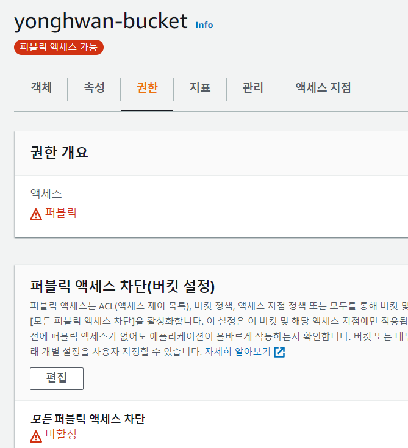
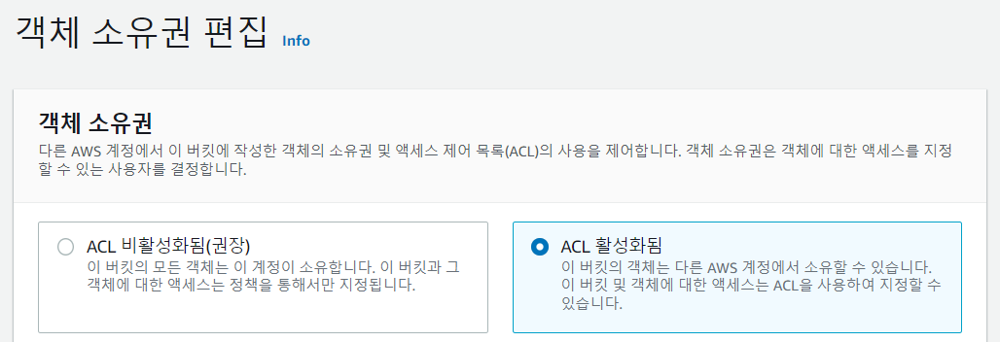

# S3 권한 제어

## S3 권한 제어 유형

- ACL
- Bucket Policy
- IAM을 이용한 제어
- PresignedURL (매우 유용함)

## 파일을 public으로 설정하기

1. 버킷 퍼블릭 액세스 차단 해제

- 버킷 선택 -> 퍼블릭 액세스 차단 -> 편집 -> 모든 퍼블릭 액세스 차단 해제

2. 버킷의 ACL 활성화

- 버킷 선택 -> 권한 -> 객체 소유권 설정 -> 편집 -> ACL 활성화됨 선택
  
  
  

3. 버킷의 ACL 편집에서 버킷 ACL 읽기 설정

- ACL -> 편집 -> 모든 사람(퍼블릭 액세스) -> 버킷 ACL 읽기 선택

4. 폴더 및 파일 ACL을 통한 퍼블릭 설정

- 퍼블릭으로 설정할 폴더 및 파일을 선택 -> 작업 -> ACL을 통해 퍼블릭으로 설정 클릭

5. 파일의 객체 URL을 클릭하여 공개되었는지 확인

## Bucket Policy로 특정 폴더 아래에 모든 파일 public으로 설정하기

1. 정책 생성기 접속

- 버킷 선택 -> 권한 -> 버킷 정책의 편집 -> 정책 생성기

2. 정책 생성기 정보 입력
   

- Select Type of Policy : S3 Bucket Policy
- Effect : Allow
- Principal(대상) : * (모두)
- ARN : 버킷 ARN/public/*
    - 버킷 ARN/public/* : 버킷 경로에 public 폴더 아래 전부 대상

3. Generate Policy 버튼 클릭하고 정책 생성
4. 정책 내용을 복사하고 버킷 정책에 붙여넣기
5. 변경사항 저장
6. 버킷 폴더에 public 폴더 아래 객체가 공개 되었는지 확인

