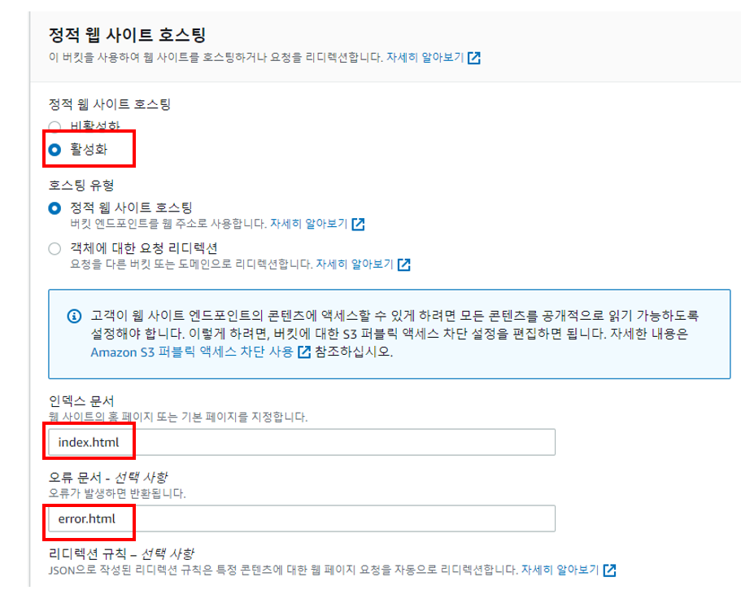

# S3 기능과 특징

## CLI로 S3 제어

- 설정 확인
- 버킷 생성
- 파일 업로드/다운로드
- 디렉토리 동기화
- ACL 수정

## S3 접근 위한 aws 설정

1. aws 설정

```shell
$ aws configure
region : ap-northeast-2
output format : json
```

2. s3 서비스에 버킷 리스트 조회

```shell
$ aws s3 ls
```


## CLI을 이용한 버킷 생성

### 명령어 형식

```shell
$ aws s3 mb 버킷경로
```

### 명령어 예시

1. yonghwan-bucket2라는 이름의 버킷 생성

```shell
$ aws s3 mb s3://yonghwan-bucket2
```

2. 버킷 생성 확인

```shell
$ aws s3 ls
```


## CLI을 이용한 파일 복사

### 명령어 형식

```shell
$ aws s3 cp 파일이름 버킷경로
```

### 명령어 예시

1. log.txt 파일을 yonghwan-bucket2에 복사

```shell
$ aws s3 cp log.txt s3://yonghwan-bucket2/
```

2. log.txt 파일을 yonghwan-bucket2/hello 폴더에 복사

```shell
$ aws s3 cp log.txt s3://yonghwan-bucket2/hello/
```


## CLI을 이용한 파일 다운로드

### 명령어 형식

```shell
$ aws s3 cp 버킷경로 로컬경로
```

### 명령어 예시

```shell
$ aws s3 s3://yonghwan-bucket2/log.txt ./
```

## CLI을 이용한 파일 삭제

### 명령어 형식

```shell
$ aws s3 rm 버킷경로
```

### 명령어 예시

```shell
$ aws s3 rm s3://yonghwan-bucket2/hello/log.txt
```

## 디렉토리 동기화

### 명령어 형식

```shell
$ aws s3 sync 로컬경로 버킷경로
```

### 명령어 예시

```shell
$ aws s3 sync ./ s3://yonghwan-bucket2
```

## ACL을 이용하여 특정 파일을 Public으로 설정하기

### 명령어 형식

```shell
$ aws s3api put-object-acl --bucket 버킷이름 --key 객체경로 --acl 지정된ACL
```

### 명령어 예시

1. yonghwan-bucket2에 있는 images/bspeak.jpg 파일을 PUBLIC으로 설정합니다.

```shell
$ aws s3api put-object-acl --bucket yonghwan-bucket2 --key images/bspeak.jpg --acl public-read
```

## 정적 웹 사이트 호스팅 기능 사용하기

1. 버킷 선택 -> 속성 -> 정적 웹사이트 호스팅의 편집 선택 -> 정적 웹사이트 활성화


2. 인덱스 문서와 오류 문서 html 파일 입력



3. 변경사항 저장하고 정적 웹사이트가 되는지 확인합니다.


## Multipart upload

- CLI 또는 SDK(C, Java, Python 등) 사용시 : 단일 PUT 사용으로 5GB까지 업로드가 가능합니다.
- 관리 콘솔 : 160GB 제한
- multipart upload : CLI 또는 SDK로 사용이 가능하고 최대 5TB까지 가능합니다.
    - 대용량의 파일을 여러개로 분할해서 업로드를 전송하는 것

## S3 요금

- 프리티어 사용중이더라도 요금이 부과될 수 있습니다.
- 비용 알람 설정 필수입니다.
- 스토리지 클래스와 라이프 사이클을 사용하면 비용을 절감할 수 있습니다.

## 라이프 사이클

- 파일(ex, 로그파일)을 생성한 후에 한달이 지나면 사용을 하지 않을 가능성이
  높기 때문에 30일 이후 onezone_IA로 지정되고, 이후 30일 지나면 glacier로 이동될 수 있게 설정이 가능합니다.
  또한, 6개월 후에는 삭제되도록 파일의 라이프 사이클을 설정할 수 있습니다.
- 보안 규정 준수를 하기 위해서 파일의 생명주기를 설정해야 합니다.

## 버전 관리(Versioning)

- 버킷 속성에서 버전 관리를 활성화하면 쉽게 사용이 가능합니다.
- 변경 내용을 추적 할 수 있습니다.
- 단, 비용이 발생할 수 있습니다. 예를 들어 100MB 파일을 5번 업로드하면 500MB로 계산되어 과금 기준을 넘으면 비용이 발생할 수 있습니다.
- 버전 관리 활성화시 라이프 사이클 관리 기능이 다소 복잡해질 수 잇습니다.

## 최종 일관성(Eventual Consistency)

- 최종 일관성은 분산 시스템에서 데이터 일관성을 유지하기 위한 일종의 데이터 복제 방식입니다.
- 분산 시스템에서 데이터의 변경 사항이 여러 노드에 동시에 적용되지 않고,
  시간이 지난후에 비로소 모든 노드에 일관성을 보장합니다.
- 강력한 쓰기 후 읽기 일관성 제공합니다.
- 예를 들어 전자 상거래 웹 사이트에서 많은 고객이 동시에 상품을 주문할 수 있습니다.
  이때, 여러 서버에서 상품 정보를 복제한후 각 서버에서 주문이 처리되면, 일부 서버에서는
  주문 정보가 더 빨리 처리될 수 있습니다. 이 경우, 모든 서버에서 주문 정보가
  동시에 적용되지 않더라도 일정 시간이 지나면 모든 서버에서 동일한 상태가 유지됩니다.

즉, Eventual Consistency 방식은 데이터의 일관성이 즉시 유지되지 않더라도,
시간이 지나면 모든 노드에서 일관성이 보장되는 방식입니다.

