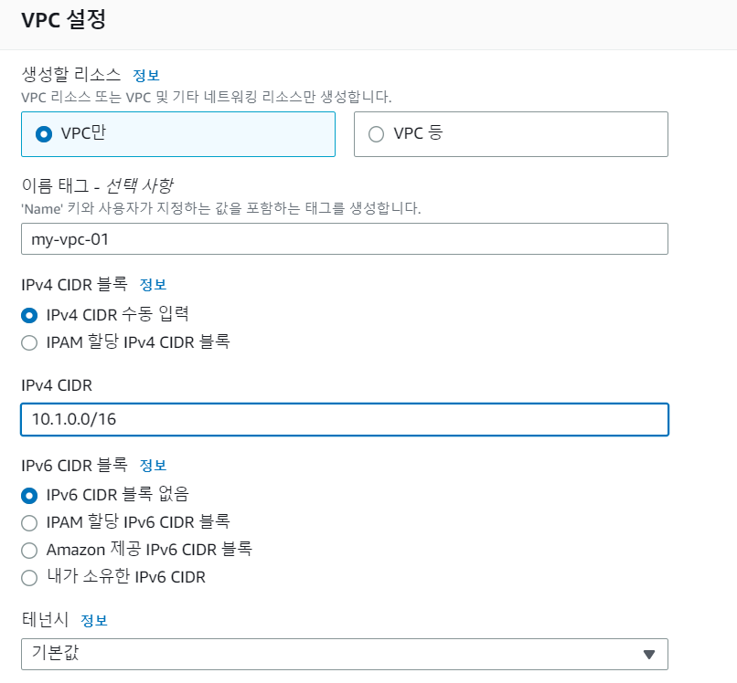
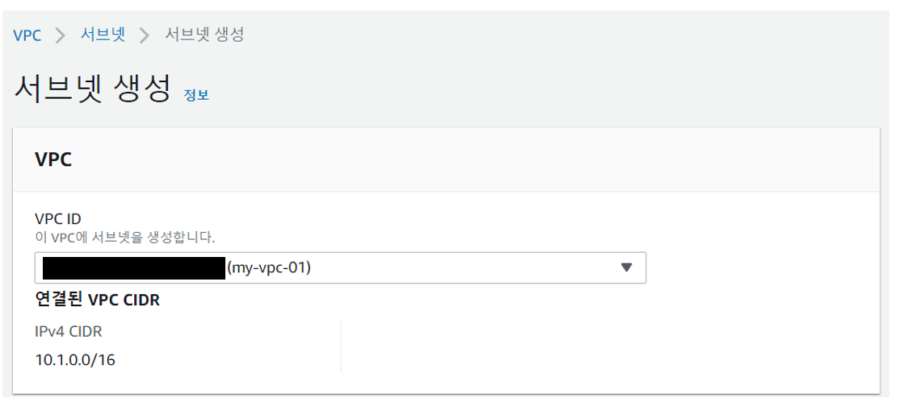
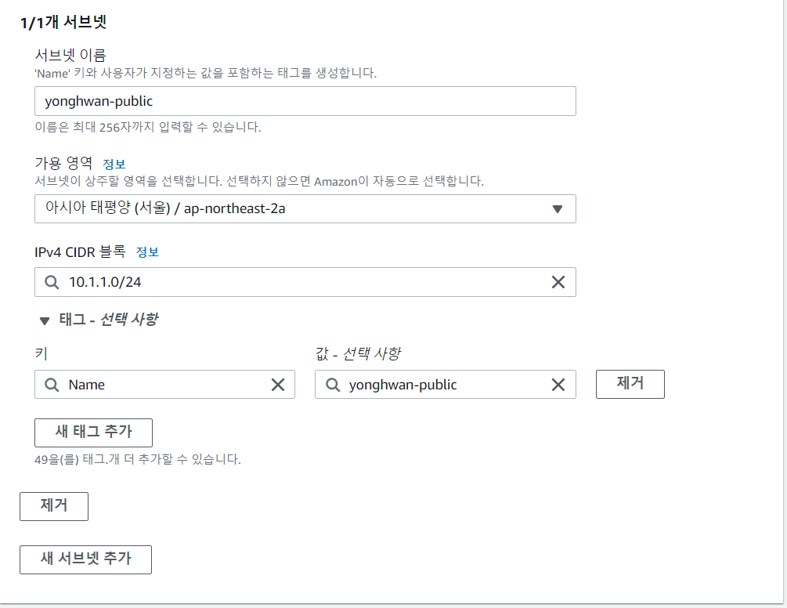
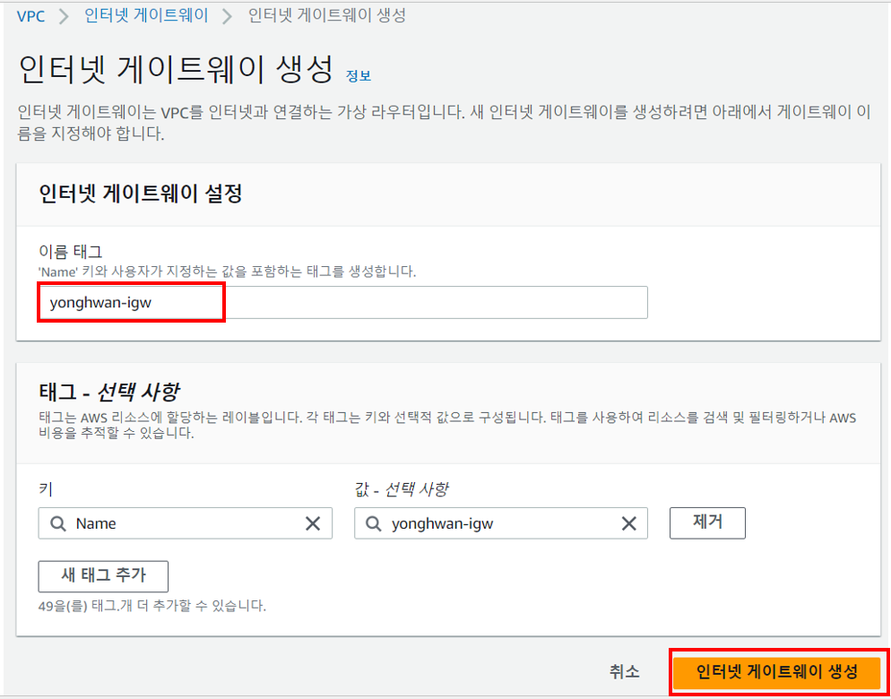
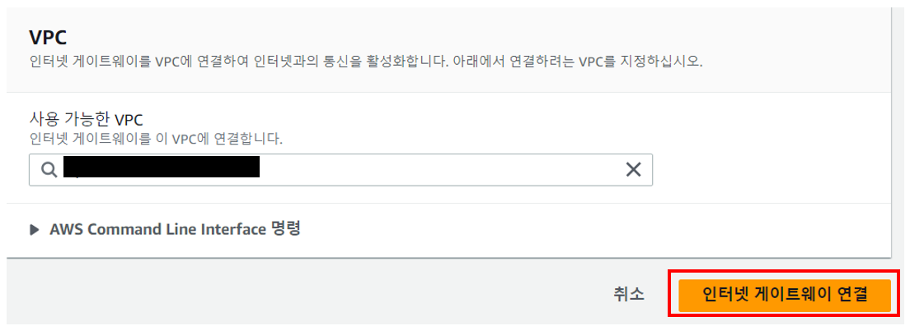
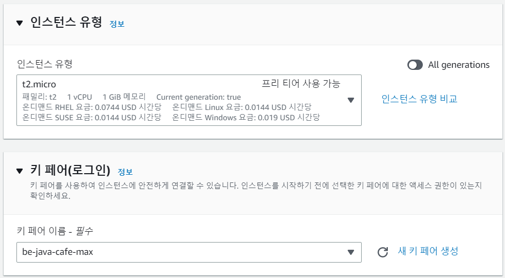
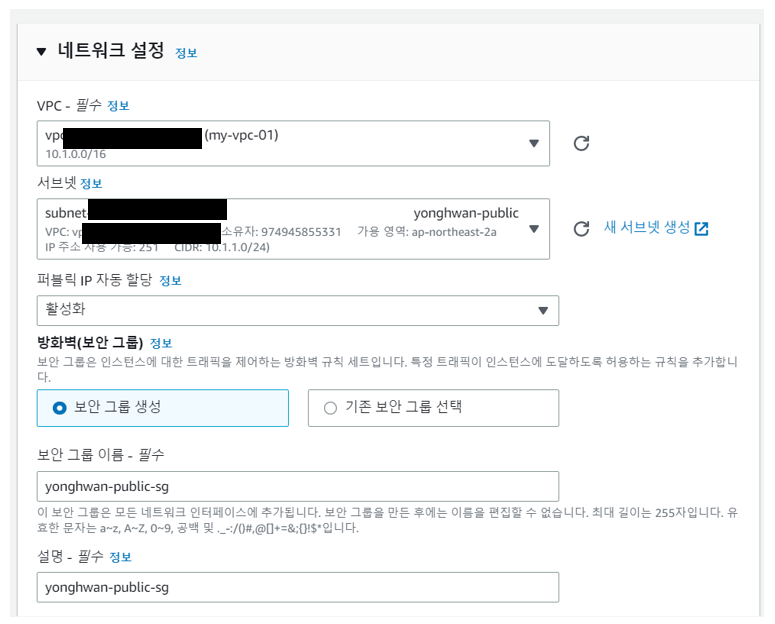
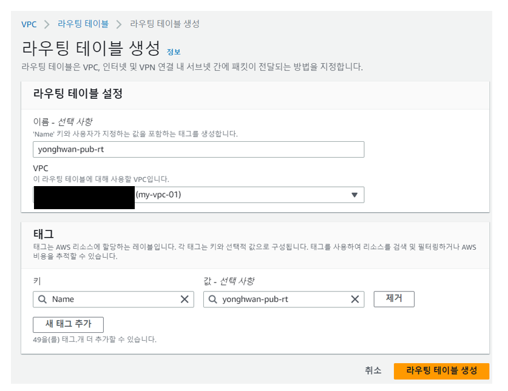
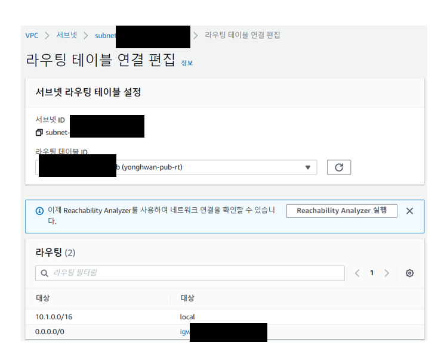
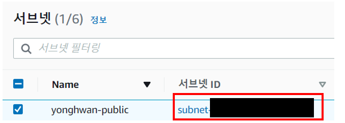

# VPC 실습

# VPC 생성

1. VPC 대시보드 입장
2. VPC 생성

3. 이름 작성
4. IPv4 CIDR 블록 지정
5. 생성

# 서브넷 생성 및 라우팅 테이블 연결 확인

## 서브넷 만들기

- 서브넷은 VPC CIDR 블록의 서브넷으로 생성합니다.
- CIDR 범위를 지정하고 AZ를 지정합니다.
- 중요: enable public IP 옵션을 선택할 수 있습니다.
- 서브넷은 반드시 하나의 라우팅 테이블을 연결합니다.

## 서브넷 만들기 실습

1. 서브넷 입장
2. 서브넷 생성

3. 이전 생성한 VPC 선택

4. 서브넷 2개 생성

5. 서브넷의 라우팅 테이블을 확인하여 10.1.0.0/16인지 확인

# 인터넷 게이트웨이 생성 및 VPC 연결

## 인터넷 게이트웨이 추가

- 인터넷 게이트웨이(IGW)를 VPC에 연결하지 않으면 VPC에서 인터넷을 할 수 없다.
- 대부분의 경우 IGW를 생성해서 VPC에 연결한다.

## 인터넷 게이트웨이 생성 실습

1. 인터넷 게이트웨이 메뉴 클릭

2. 인터넷 게이트웨이 생성

3. VPC에 연결 클릭

5. 이전에 만든 vpc 선택

# Public subnet

## 서브넷과 라우팅 테이블

- 서브넷이 인터넷과 연결하기 위해서 라우팅 규칙이 필요합니다.
- 라우팅 테이블 생성
- 해당 라우팅 테이블에 인터넷을 위한 규칙 생성
- 지정된 서브넷과 라우팅 테이블을 연결합니다.

## Public 서브넷이란?

- 인터넷 게이트웨이 규칙을 가지고 있는 서브넷을 public 서브넷이라고 합니다.
- 인터넷 세상에 열려있다는 의미입니다.
- 웹 서버, Bastion Server(Jump server) 등이 위치합니다.
- WAS(Web Application Server)의 위치는 상황에 따라 다르지만 public 서브넷에 놓는 경우가 많습니다.

# public subnet 라우팅 테이블 연결 및 확인

## 라우팅 테이블 생성

EC2 인스턴스를 다시 한번 만들고 만드는 도중 인스턴스 생성 설정에서 우리가 만든 VPC를 연결을 실습하고자 합니다.

1. 인스턴스 생성

3. 라우팅 테이블 메뉴 접속

2. 라우팅 테이블 생성

3. 라우팅 테이블 편집

4. 라우팅 추가

## 라우팅 테이블을 서브넷에 연결하기

1. public한 서브넷 ID를 선택하여 들어갑니다.

3. yonghwan-public 서브넷을 yonghwan-pub-rt로 연결하기

# Private Subnet과 NAT Gateway

## Private Subnet

- 인터넷이 연결되지 않은 서브넷을 Private subnet이라고 합니다.
- 데이터베이스가 이곳에 위치합니다.
- 인터넷을 하기 위해서는 NAT 인스턴스, NAT 게이트웨이 등이 필요합니다.
- 팁: NAT 게이트웨이는 비싸기 때문에 가격에 주의해야 합니다.
- private subnet은 인터넷과 간접적으로 연결되어 있습니다.

## Private 서브넷에서 인터넷 사용방법

- NAT Gateway 서비스 이용 (월 5만원)
- EC2로 직접 NAT instance 구축 (권장)

# 서브넷 public ip 자동 할당

1. 서브넷 메뉴 입장
2. public 서브넷 선택

3. 작업 -> 서브넷 설정 편집 선택

4. 퍼블릭 IPv4 주소 자동 할당 활성화 선택

# ec2 private instance에 접속하기

핵심 키워드 : key-forwarding

